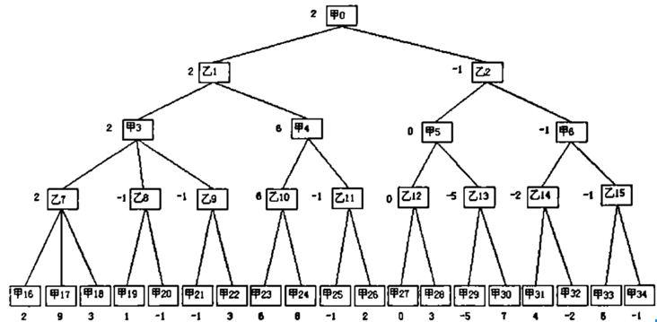
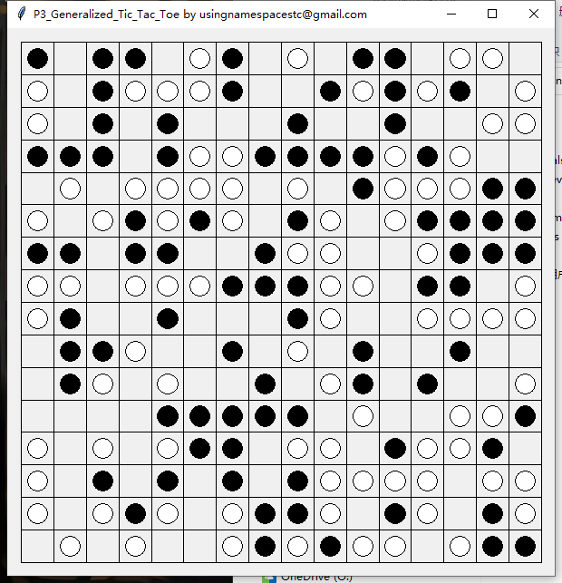

# P3_Generalized_Tic_Tac_Toe
Link of this repo(private, needs invitation): https://github.com/usingnamespacestc/P3_Generalized_Tic_Tac_Toe
## Requirements
* For Windows, Python must be 3.8.3+
* For macOS, Python must be 3.10+, or else the GUI won't show
* Linux not tested
## Basic Features(Implemented)
### Tests
Run ```py.test``` to get the test results. I wrote the tests for  important functions.
### Negative Max + Alpha Beta
Basic search method. Already implemented but still needs some adjustments to get a better result. With this function, the game is playable. 

Key line: 235~238

Function may still change due to adjustments

The layers 0, 2, 4, 6... are self score while layers 1, 3, 5, 7 are the score of the rival. This is a simplified way to do min-max. With "-" added at layer 1, 3, 5, 7, we can use one function, which only finds the max, to search both min and max.
### Score Model
Because the goal is only known when the game starts, we have to generate the score model dynamically. Here is a sample score model when 5 to win:
```
# level  0
# dead   1
[1, [2, 1, 0], False],
# level  1
# living 1
[10, [0, 1, 0], True],
# dead   2
[10, [2, 1, 1, 0], False],
# level  2
# living 2
[100, [0, 1, 1, 0], True],
[100, [0, 1, 0, 1, 0], True],  # abandoned
# dead   3
[100, [2, 1, 1, 1, 0], False],
# level  3
# living 3
[1000, [0, 1, 1, 1, 0], True],
[1000, [0, 1, 1, 0, 1, 0], False],  # abandoned
# dead   4
[1000, [2, 1, 1, 1, 1, 0], False],
[1000, [2, 1, 1, 1, 0, 1], False],  # abandoned
# level  5
# living 4
[10000, [0, 1, 1, 1, 1, 0], True],
# level6
# any    5
[100000, [1, 1, 1, 1, 1], True]
```
First col is the score, which is pow(10, level). The number of level is how many pieces are linked. The "living"(no enemy nearby) sequence has higher score than "dead" ones. The second col is the match pattern. If a col(or row or cross) has that shape inside, the player gains the score. The third col means is the pattern symmetry or not. If it is not symmetry then that pattern should be reversed and match again. 

After second thought, I decide not to put those "abandoned" rule into use. For example, the value of ```[0, 1, 1, 0, 1, 0]``` is its potential of becoming a 4 ```[1, 1, 1, 1]```. Even if I don't add it, it will still be searched in the next step. However, if I add all them, it will significantly increase the code complexity and may cause unknown problems. 

Following these rules, we can generate our score model easily.

The way I check if the pattern exist in a line is to use the method of string. Convert the patterns and the lines into strings first, and then we can use syntax like ```if '010' in '0010'``` to check them.
## GUI
I also added a GUI to visualize the steps. The GUI is running in another process, so it doesn't jam the program or being jammed. The GUI process communicates with the main process using shared memory. 

Picture is just a test run of GUI, doesn't represent a real game.
# Other Features(To be added)
### Heuristic
Sort the possible nodes and makes the search faster. Alpha beta pruning also benefits from this. For now, I would like to sort the possible positions by the overall score if the player place at this position.
### Optimize the path
When we are going to win, we should choose the shortest path. When we are going to lose, we should choose the longest path.
### Zobrist Hash
It is a hash algorithm widely used in chess games. To reach one status, we usually have more than one path. Grading the same situation because the paths are different is a waste of time. If we use a hash method to map the scores and the existing situations in a cache, then we can save a lot of time.
### Multicore Processing
Don't know if it's possible to add this. Maybe the tree search isn't suitable for multicore processing. But anyway, I don't think I have time to write this code before the final due date of scoring.